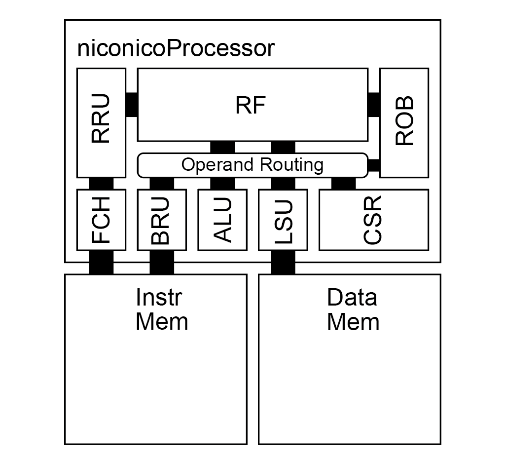

# niconicoProcessor

## RISC-V Microprocessor

### Features
- **Baseline** RISC-V ISA (RV32I).
- In-Order Execution.
- 32bit Word Datapath.
- ALU, Ld/St Unit, Branch Unit, CSR.
- Register Rename and Reorder Buffer are supported.
- 48-entry Architectural Register File (Parameterized)
- Exception and Interrupt are **not** supported.

### License
Apache Version 2.0
